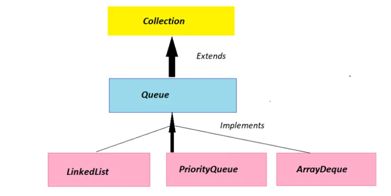
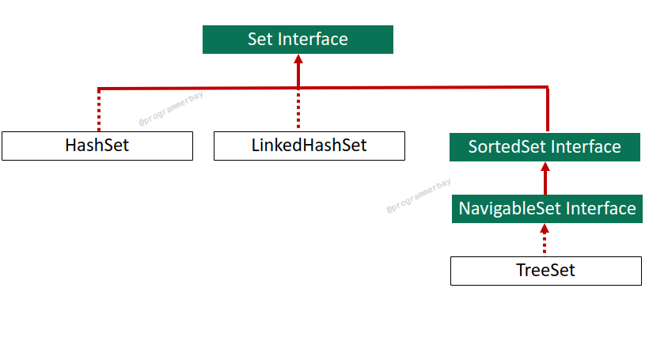

## Queue Interface

### Methods of Queue
1. boolean add(E e) - Inserts element into this queue returning true upon success and throwing an IllegalStateException if no space is currently available.
2. E offer(E e) - Inserts the element into this queue if it is possible to do so
3. E remove() - Retrieves and removes the head of this queue.
4. E poll() - Retrieves and removes the head of this queue, or returns null if this queue is empty.
5. E peek() - Retrieves, but does not remove, the head of this queue, or returns null if this queue is empty. 

## Set

### Methods of HashSet
- This class uses Hash Table Data Structure
- Duplicate value not allowed, if you insert duplicate value it will return false
- Insertion order is not preserved, it will store base on the hashtable
- Heterogenous objects are allowed
- Null value allowed
- Searching is very efficient

Note: Hashset create a 16 bucket memory, whenever 75% of the buckrt gets filled, the hashset recreates a space with more memory.

- HashSet() : Doesn't preserve Insertion order
- LinkedHashSet() : Preserve Insertion Order
- TreeSet() : Store in sorted order

> Remember: Object of class are made not of Interface

## Map
It stores data in Key-Value pair.

### Methods of Map
1. void put(K key, V value)
2. Object remove(Object key) - returns the object
3. Object get(Object key) - return the value
4. boolean containsKey(Object key) - Returns true if this map contains a mapping for the specified key.
5. Set keySet() - Returns a Set view of the keys contained in this map.
6. Set keyValue() - Returns all key-value pairs

- HashMap - Both Null key and value possible
- LinkedHashMap - Both Null key and value possible
- HashTable - cannot insert any Null key or value
- SortedMap
- NavigableMap -> TreeMap - key cant be Null but value is possible